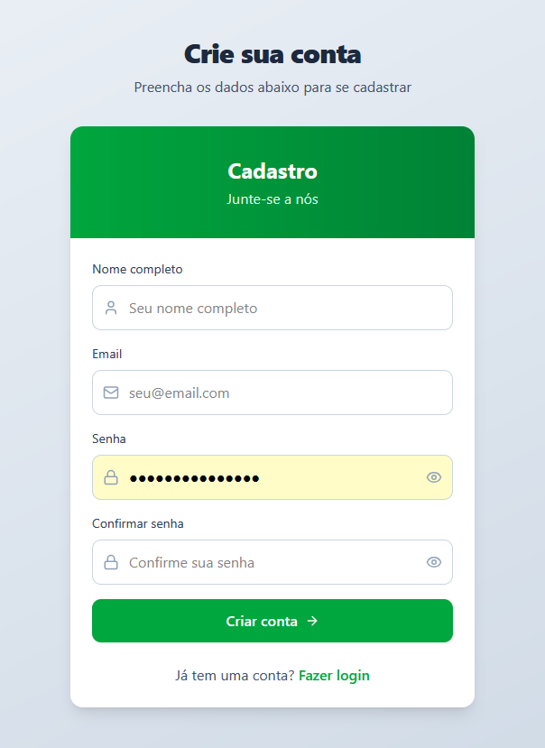
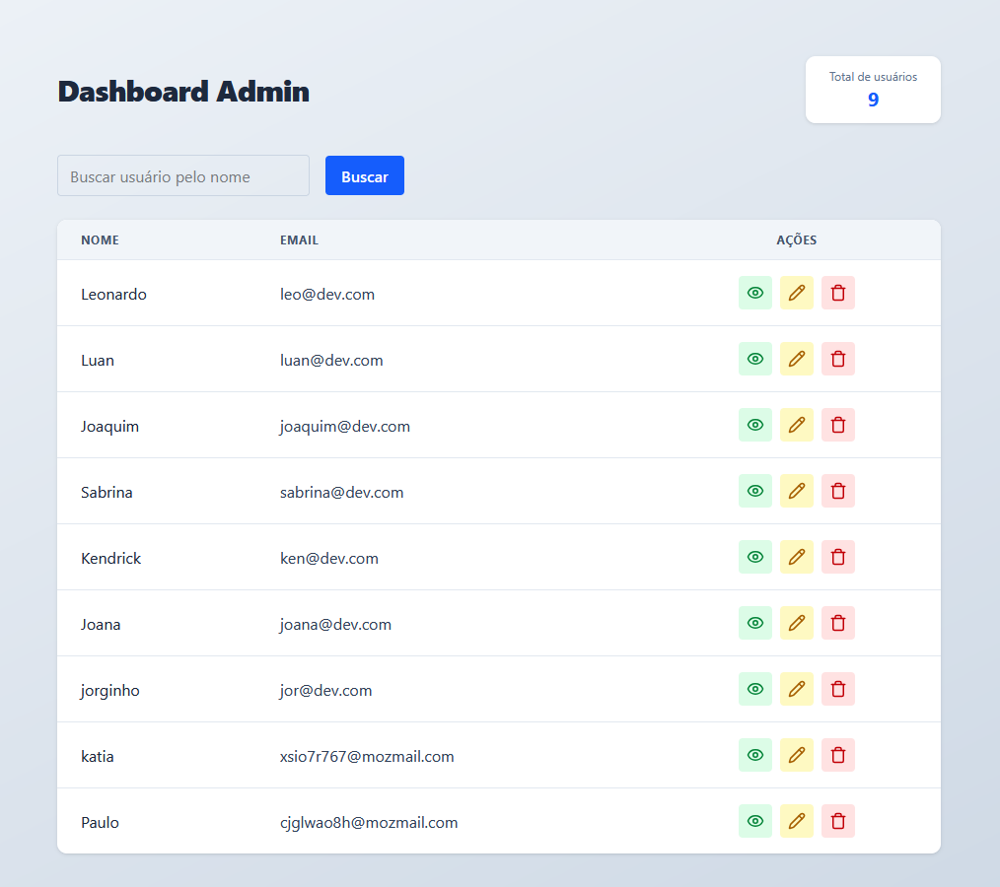
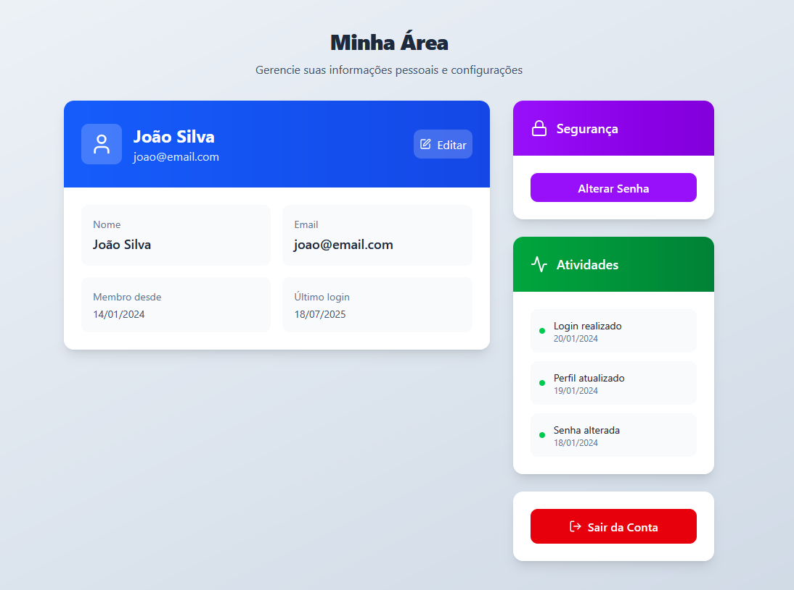

# 🚀 User Dashboard API

### Olá, devs!
<div align="center">
  
</div>

Com muito prazer, eu venho apresentar meu projeto de Controle de User via Dashboard!

## 📋 Descrição

Sistema full-stack que permite cadastro e login de usuários, com área específica para administradores gerenciarem todos os usuários do sistema. O projeto inclui autenticação JWT, autorização por roles e um dashboard administrativo completo.


## ✨ Funcionalidades

### 🔐 Autenticação e Autorização
- **Cadastro de usuários** com validação de dados
- **Login seguro** com JWT (JSON Web Tokens)
- **Autorização por roles** (usuário/admin)
- **Proteção de rotas** com middlewares

### 👤 Área do Usuário
- Acesso às informações pessoais
- Gerenciamento de configurações de conta
- Histórico de atividades

### 🛡️ Área do Administrador
- **Dashboard completo** com estatísticas
- **Listagem de usuários** em tabela organizada
- **Busca de usuários** por nome
- **Ações CRUD** (visualizar, editar, excluir)
- **Contador de usuários** em tempo real

## 🛠️ Tecnologias Utilizadas

### Backend
- **Node.js** - Runtime JavaScript
- **Express.js** - Framework web
- **TypeScript** - Linguagem tipada
- **Prisma** - ORM para banco de dados
- **JWT** - Autenticação por tokens
- **Joi** - Validação de dados
- **bcrypt** - Criptografia de senhas
- **CORS** - Cross-Origin Resource Sharing

### Frontend
- **Next.js** - Framework React
- **React** - Biblioteca JavaScript
- **Tailwind CSS** - Framework CSS
- **TypeScript** - Linguagem tipada

### Banco de Dados
- **MongoDB** (via Prisma)

## 🚀 Como Executar

### Pré-requisitos
- Node.js (versão 16 ou superior)
- npm ou yarn

### 1. Clone o repositório
```bash
git clone <https://github.com/LucaDevel0per/api-dashboard>
cd user-dashboard-api
```

### 2. Instale as dependências
```bash
npm install
```

### 3. Configure as variáveis de ambiente
Crie um arquivo `.env` na raiz do projeto:
```env
PORT=3001
DATABASE_URL="file:./dev.db"
JWT_SECRET="sua-chave-secreta-aqui"
```

### 4. Configure o banco de dados
```bash
npx prisma generate
npx prisma db push
```

### 5. Execute o servidor
```bash
npm run dev
```

O servidor estará rodando em `http://localhost:3001`

## 📁 Estrutura do Projeto

```
user-dashboard-api/
├── src/
│   ├── @types/           # Tipos TypeScript
│   ├── middlewares/      # Middlewares de autenticação
│   │   ├── isAdmin.ts
│   │   └── verifyToken.ts
│   ├── prisma/          # Configuração do Prisma
│   │   └── client.ts
│   ├── routes/          # Rotas da API
│   │   ├── auth.ts      # Rotas de autenticação
│   │   ├── privates.ts  # Rotas protegidas
│   │   └── user.ts      # Rotas de usuário
│   ├── validations/     # Validações
│   │   └── authValidation.ts
│   └── server.ts        # Servidor principal
├── prisma/
│   └── schema.prisma    # Schema do banco de dados
└── package.json
```

## 🔧 Rotas da API

### Autenticação
- `POST /api/register` - Cadastro de usuário
- `POST /api/login` - Login de usuário

### Rotas Protegidas (Admin)
- `GET /api/dashboard` - Dashboard administrativo
- `GET /api/users` - Lista de usuários
- `PUT /api/users/:id` - Atualizar usuário
- `DELETE /api/users/:id` - Excluir usuário

## 🎨 Interface do Usuário

O sistema possui uma interface moderna e intuitiva:

### 📝 Página de Cadastro

*Formulário limpo com validação de dados e design moderno*

### 🔐 Página de Login

*Interface elegante com ícones intuitivos e campos de validação*

### 🛡️ Dashboard Administrativo

*Tabela completa com ações CRUD e contador de usuários*

### 🛡️ Área do user

*Tabela completa com ações CRUD e contador de usuários*

## 🔒 Segurança

- **Senhas criptografadas** com bcrypt
- **Autenticação JWT** para sessões seguras
- **Autorização por roles** para controle de acesso
- **Validação de dados** no frontend e backend
- **CORS configurado** para segurança

## 🤝 Contribuição

1. Faça um fork do projeto
2. Crie uma branch para sua feature (`git checkout -b feature/AmazingFeature`)
3. Commit suas mudanças (`git commit -m 'Add some AmazingFeature'`)
4. Push para a branch (`git push origin feature/AmazingFeature`)
5. Abra um Pull Request

## 📝 Licença

Este projeto está sob a licença MIT. Veja o arquivo `LICENSE` para mais detalhes.

## 👨‍💻 Autor

**Seu Nome**
- GitHub: [@LucaDevel0per](https://github.com/LucaDevel0per)

---

⭐ Se você gostou deste projeto, deixe uma estrela no repositório! 
